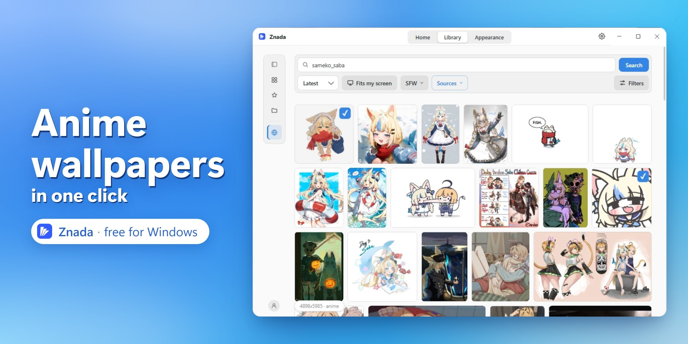

<p align="center">
  
</p>

<p align="center">
  <a href="https://github.com/alexvlass01/znada/releases/latest/download/Znada-Setup.exe"></a>
</p>

<p align="center">
  <a href="https://github.com/alexvlass01/znada/releases/latest"></a>
  
  
</p>

**Znada** is a wallpaper app for Windows. Find anime art and other wallpapers online,
keep your favourites in a library, and choose what goes on each monitor.

Search **Gelbooru, Danbooru and Wallhaven** from inside the app — including art of your
favourite characters. You can also add your own pictures and folders, rotate a collection
as a slideshow, and use different wallpapers for day and night.

> **Windows only.**

## ⬇️ Download

**[Download Znada for Windows »](https://github.com/alexvlass01/znada/releases/latest/download/Znada-Setup.exe)**

[Release notes and other downloads](https://github.com/alexvlass01/znada/releases/latest)

1. Download **`Znada-Setup.exe`** using the link above.
2. Double-click it — Znada installs and opens automatically (no setup wizard, like Discord or VS Code).
3. A short welcome screen helps you choose a language, turn on automatic switching and autostart, and create shortcuts.

Znada isn't code-signed yet, so Windows may show a warning the first time you run the installer: click **More info**, then **Run anyway**.

That's it. The app keeps running in the **system tray** after you close the window — you **don't** need to run the installer again to "turn it on".

## Features

- 🌐 **Find art inside the app** — search Gelbooru, Danbooru and Wallhaven by tags, browse results, and download pictures to your library.
- 📚 **Wallpaper library** — keep all your wallpapers in one place: mark favourites, add tags, and browse folders. Open a folder to see what's inside, step into sub-folders, and find your way back with breadcrumbs.
- 🖥 **A different wallpaper per monitor**, with a visual monitor map.
- 🌗 **Separate wallpapers for day and night** — one for the light theme, another for dark. Switch them automatically with the Windows theme.
- 🗂 **Live folders** — connect a folder and Znada will pick up new wallpapers you add there.
- 🔀 **Slideshow** — let a set of wallpapers rotate on a timer instead of showing just one picture.
- 🖱 **Drag & drop** — drop an image straight onto the app to add it.
- 🌓 **Scheduled light and dark mode** — Znada can switch the Windows theme itself at fixed times or at sunrise/sunset for your location.
- ⌨️ **Global hotkey** — jump to the next wallpaper with a keyboard shortcut.
- 🎮 **Game Mode** — pauses wallpaper and theme changes while you play games or use full-screen apps.
- 🥷 **Quiet switching** — when a full-screen window is open, Znada waits and changes the wallpaper without interrupting you.
- 🎚 **Fit modes:** fill, fit, stretch, center, tile, or span across monitors.
- 📌 **Tray app** that runs in the background; 🚀 optional **autostart** with Windows.
- 🌍 **30 languages** (or just follow your system language).
- 🎨 Clean **Adwaita-style** interface with light and dark palettes.

## How it works

- Add your own pictures to the library, or open **Library → Online** to find art by tags.
- Choose wallpapers in **Appearance**, or use a slideshow to rotate your collection.
- For automatic day/night switching, Znada follows the Windows light/dark setting (*Settings → Personalization → Colors → Mode*) or uses its own schedule.
- It sets a separate wallpaper on each monitor using built-in Windows features — no extra software or drivers.
- Individual wallpapers you pick are copied into the app's own folder, so they don't disappear after an update or if you move the original. Connected live folders stay linked to their original location.

**Desktop wallpapers are currently still images.** Animated pictures use a still frame on the desktop.

## Build from source (for developers)

```powershell
npm install
npm start            # run from source
npm run package      # local unpacked test build -> dist/Znada-win32-x64/
npm run installer    # installer        -> dist/installer/Znada-Setup.exe
```

Built primarily with Electron + plain HTML/CSS/JS, plus a small Windows thumbnail helper. The
renderer is framework-free today, but focused dependencies and build tooling are welcome when they
have a clear maintenance or measured performance payoff. Source setup remains a single `npm install`.

## License

All rights reserved. The source is published so it can be read; see [LICENSE](LICENSE).
